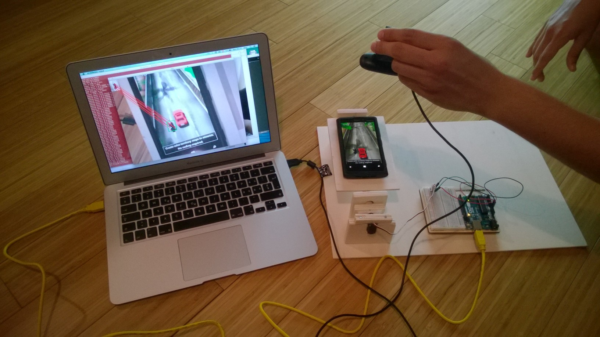

# BeatTheBot: Can humans still beat robots?

BeatTheBot is a challenge where humans compete against a robot to play the free and popular AE 3D Motor game: play it on [Windows Phone](http://www.windowsphone.com/en-us/store/app/ae-3d-motor/bb5f1317-735d-4e60-a100-9c3f1692ee7c), [Android](https://play.google.com/store/apps/details?id=com.aemobile.games.aemotor3d) or [iPhone](https://itunes.apple.com/us/app/ae-3d-motor/id543841287?mt=8).

The point of AE 3D Motor is to accumulate points by driving a moto as fast and as long as possible while quickly tilting the phone left and right to zig-zag through trafic.

  

The robot is not simply some smart software: It plays the game [almost] just like you!

  

It is made of several parts:
* The servomotor is the arm, and is used to tilt the plank on which the mobile phone is laying
* The webcam is the eye, enabling the robot to see the moto, trafic, and phone borders
* An Arduino and a laptop, the two brains... yes the robot has a little advantage :)

By following the instructions on this page, you will be able to build your own robot. And if you're evil enough, you'll improve it to make the challenge even harder for humans :)

## But... why?

Because we can, of course!
More seriously, the idea of this project came to me as a way to get familiar with computer vision, and this project is a learning milestone on the way to bigger things around agricultural robots.

My hope is that this project will inspire others to experiment and follow their dreams.

## Events

Meet the robot and me at the following events:

* Lisbon Maker Faire, 18 + 19 + 20 September 2015 - TO BE CONFIRMED
* World Maker Faire New York, 26 & 27 September 2015 - TO BE CONFIRMED

## Hardware

I recommend to start from [The Arduino Starter Kit](https://www.arduino.cc/en/Main/ArduinoStarterKit), which includes the Arduino Uno, the servo motor and all the cables & connectors used in this project. Most importantly, it also comes with a book of many projects ideas to discover and familiarize yourself with the complete kit contents.

[Logitech Webcam C170](http://www.logitech.com/product/webcam-c170) is the cheapest webcam I found. I later realized that the videos were blur because it lacks auto-focus. However, this did not impact the performances of the moto detection algorithm, and I still am using this model today.

My phone is a [Nokia Lumia 920](http://www.microsoft.com/en-us/mobile/phone/lumia920/) running Windows Phone, and so I am playing the [Windows Phone version](http://www.windowsphone.com/en-us/store/app/ae-3d-motor/bb5f1317-735d-4e60-a100-9c3f1692ee7c) of the game, which might be a bit different from the [Android](https://play.google.com/store/apps/details?id=com.aemobile.games.aemotor3d) and [iPhone](https://itunes.apple.com/us/app/ae-3d-motor/id543841287?mt=8) ones.

The laptop I use is a MacBook Air, but any computer will do: The software is written to easily work on Windows, Linux, Mac and more.

[TODO: How to build the structure]

## Software

[TODO: How responsibilites are split]

[TODO: Arduino part]

[TODO: OpenCV C++ part]

## How to contribute

Code contributions are accepted through pull requests.
Other types of contributions such as ideas etc. should be sent through GitHub issues.

## Project milestones

TODO
